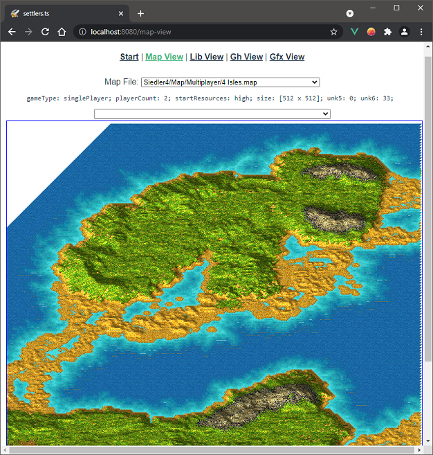
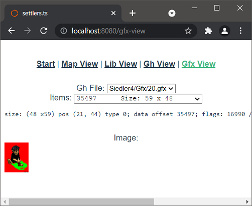
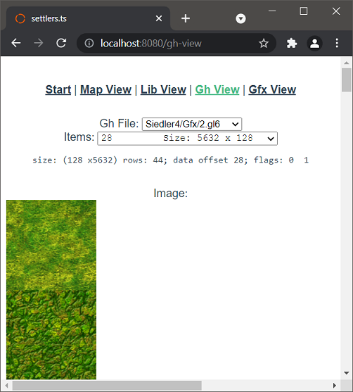
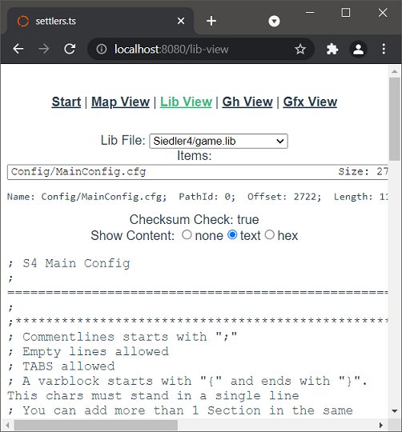
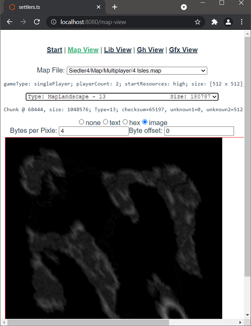

# Settlers 4 remake (File Formats)
This is a Settlers 4 (Siedler 4) Remake (it will be :-) ) written in JavaScript (Typescript) so
  it can be run in your browser.

<p style="text-align:center" align="center">
<a href="https://settlers.hmilch.net/">🎉 run the "game" 🎉</a>
</p>


# Prerequisites

- [Node.js](https://nodejs.org/) (v18+)
- A legal copy of **Settlers 4** (e.g. *The Settlers History Collection* / *Settlers United* from Ubisoft)


# Quick start

### 1. Set up game files

The app needs original Settlers 4 assets. On a Windows machine with the game installed, export them:

```powershell
.\scripts\export-game-files.ps1 -SourcePath "D:\path\to\settlers4"
```

Then import the zip(s) on your dev machine:

```sh
python3 scripts/import-game-files.py /path/to/zips
```

See [docs/game-files-setup.md](docs/game-files-setup.md) for manual setup, expected file structure, and troubleshooting.

### 2. Install and run

```sh
pnpm install
pnpm dev
```

Open http://localhost:5173/


# Development

### Build for production

```sh
pnpm build
```

### Lint

```sh
pnpm lint:fix
```

### Tests

```sh
pnpm test:unit
```


# State

## Load/view a Map

View Landscape using WebGL



## View / decode file formats
You can access 'all' Settlers file formats

### gfx-file view:


### gl-file and gh-file view:


### lib-file view:


### map-file view:



# Disclaimer
This Software reads the original graphics/data from the original *Settlers 4* title released by Blue Byte® — The authors of this Software do not claim any rights on any of that data nor the name *Siedler* and *Settlers*.
